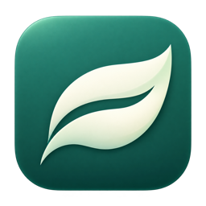

# 轻缓存

为 Apple Silicon Mac 制作的原生缓存整理、内存巡检与 agent 浏览器回收应用。要求 macOS 14 或更新版本。



## 下载和更新

- [最新版下载页](https://github.com/ChrisXHL/MacCacheCare/releases/latest)
- [所有历史版本](https://github.com/ChrisXHL/MacCacheCare/releases)

在最新版的 Assets 中下载 `MacCacheCare-macOS-arm64.zip`，解压并放入 `~/Applications/`（个人应用程序目录）。私有仓库需要先登录具有访问权限的 GitHub 账号。

更新时，先从菜单栏退出轻缓存，再用新版本替换同一目录下的旧应用，然后重新打开。设置、保留会话和恢复记录保存在应用包外，替换应用会继续使用。不要同时运行新旧两份应用。

应用菜单和菜单栏均有“下载与更新”入口，打开 GitHub 最新版页面。这是手动下载更新；不会在后台下载或自行安装。首次在另一台 Mac 安装时，自动整理与浏览器回收默认关闭，需要按需开启。

当前为 ad-hoc 签名，尚未经过 Apple 公证。如果 macOS 提示无法验证开发者，请先核对下载来源，再按 [Apple 官方说明](https://support.apple.com/zh-cn/102445) 在“隐私与安全性”允许打开。下载附有 `SHA256SUMS.txt`，可用 `shasum -a 256 -c SHA256SUMS.txt` 检查文件完整性。

浏览器回收以 10 分钟无命令为阈值，每分钟检查，不要求电脑闲置。

## 使用

1. 打开「轻缓存」查看内存压力、压缩内存、交换空间、磁盘可用空间。
2. 在「缓存整理」中点击「查看文件」预览候选项；「移入废纸篓」会重新扫描和检查占用情况。
3. 「自动整理」开启后，应用运行期间每 6 小时检查一次。需要闲置至少 5 分钟、内存压力正常、温度正常、未开启低电量模式；执行过程中重新检查使用状态。
4. 关闭窗口后仍可从菜单栏的叶子图标打开。菜单栏选择「退出轻缓存」停止全部检查。应用未运行时不会自动整理。
5. 如需开机后继续运行，点击「登录时启动设置」，在系统登录项中添加「轻缓存」。当前没有安装后台启动项。
6. 「恢复记录」可恢复最近一个文件；如果所属程序运行、原位置出现新文件或路径变化，会暂停恢复。也可以在废纸篓中手动取回。

## 文件保护规则

只考虑当前用户家目录下的以下白名单。相关进程运行时，整个条目跳过。

| 类别 | 目录 | 运行保护匹配 |
| --- | --- | --- |
| Chrome | `Library/Caches/Google/Chrome` | Chrome、Chromium |
| Edge | `Library/Caches/Microsoft Edge` | Microsoft Edge |
| Figma | `Library/Caches/com.figma.Desktop` | Figma |
| VS Code | `Library/Caches/com.microsoft.VSCode` | VS Code、Code Helper |
| pip 下载 | `Library/Caches/pip` | Python、pip、uv、uvx |
| Homebrew 下载 | `Library/Caches/Homebrew/downloads` | brew、Ruby、curl、wget |
| npm 日志 | `.npm/_logs` | Node、npm、npx、Bun |

候选文件必须创建、修改和访问时间均超过 30 天；只允许当前用户的普通文件，不处理目录、符号链接、硬链接、不可变文件或单个超过 256 MiB 的文件。移动前重查程序、文件身份、大小、日期及打开的句柄；检查失败或不完整时跳过。

不处理 Codex / OpenAI 缓存、飞书与微信数据、浏览器用户资料、项目源码、项目构建目录、模型、浏览器安装包、uv 等运行环境、系统缓存、交换文件、APFS 快照。浏览器回收仅覆盖通过命令计时接入的默认 agent-browser 会话，按下述规则请求正常退出；不会结束普通应用，也不会调用 Ollama。

整理使用 macOS 的废纸篓 API，记录实际返回的恢复路径。**移入废纸篓仍占磁盘空间，清空废纸篓后才可能释放。应用不会自动清空废纸篓。** 再次使用已整理缓存的程序时可能重新生成或下载缓存，所以采用 30 天期限并保留恢复能力。

## 资源限制

- 每分钟读取一次进程与内存指标，使用串行队列；回收期间提高调度优先级并暂时防止 App Nap，允许电脑正常睡眠。
- 每次扫描最多 12,000 项、约 8 秒；超限显示部分扫描。
- 每次整理最多 80 个文件、约 20 秒；自动模式最多 256 MiB，手动模式最多 1 GiB。
- 内存压力高时不会自动扫描整理，只保留只读指标巡检。
- 恢复记录最多 5,000 条，达到限额停止整理，保留现有记录。
- 不请求管理员权限，不上传报告，不使用 Electron、Python 或常驻 Web 服务；下载与更新入口通过默认浏览器访问 GitHub。

时限在操作边界检查；单次系统调用耗时仍由 macOS 决定。浏览器回收使用命令活动记录，不依赖 CPU 或进程运行时间。空闲并不等于已确认任务完成；等待超过 10 分钟的任务可以在进程页点“保留”。

## 验证

`zsh test.sh` 运行保护规则测试，覆盖活跃进程、链接越界、文件变化、占用检查失败、损坏日志、恢复冲突、自动整理条件、原生内存探测和 macOS 废纸篓往返。测试只修改临时样本。

本机诊断和回收日志不提交到仓库。GitHub Actions 会在版本标签发布时重新测试并打包。

## 源码与构建

要求 Apple Silicon、macOS 14 或更新版本、Apple Swift 编译器。

```sh
zsh build.sh
zsh test.sh
zsh package.sh
```

`Sources/Core.swift` 包含扫描、保护、废纸篓、恢复与指标逻辑；`Sources/App.swift` 包含原生界面、菜单栏及调度。构建产物使用本机 ad-hoc 签名。

配置由应用的 UserDefaults 保存。恢复记录在 `~/Library/Application Support/MacCacheCare/history.json`；它不是可清缓存。卸载前如需恢复文件，应先完成恢复，再退出并将应用移入废纸篓。


## 1.1 浏览器自动回收

- 每分钟检查默认 `~/.agent-browser` 会话，连续 10 分钟没有 CLI 命令活动才进入回收候选。
- 命令开始与结束时记录时间；命令执行期间持有共享保护锁。即使命令执行超过 10 分钟，也不会回收。
- 回收前检查活动锁、进程身份、会话 PID 文件、无界面参数、临时资料目录、直接命令连接、浏览器接管连接和未完成下载。
- 默认保留 `default` 会话；可对其他会话点击“保留”。带界面、持久化资料目录、任务专属 socket 目录不在回收范围。
- 最多同时处理 3 个会话，一批最多 20 个；35 秒后不再开始新的处理，已开始的检查按各自时限完成。检查过程不阻塞新 CLI 命令，只有最后的退出步骤短暂持有独占锁。
- 请求原生 daemon 正常关闭，核对 Chrome 主进程退出；不会对这些浏览器使用 SIGKILL。
- 关闭开关后停止新的回收，正在检查的会话会在发出退出请求前再次检查开关。已经发出的正常退出请求无法撤销。
- 本功能清理的是空闲临时会话，临时页面状态可能随关闭丢失；需要跨任务保留的会话应点击“保留”。

### 命令计时接入与撤销

当前接入点是 `/opt/homebrew/bin/agent-browser`，要求它解析到可写的原生工具。已实测 agent-browser 0.26.0（Hermes 安装来源）。接入在该工具入口增加原生转发程序；原程序保留在同目录的 `.cachecare-original` 备份。其他安装形式与版本需要另外验证。

转发保持命令参数、工作目录、环境、标准输入输出及退出码；不记录命令内容。仅记录默认会话名称、开始/结束活动时间，并在命令执行期间持锁。Hermes 自己的任务专属 socket 目录直接转发，不纳入此回收。

应用退出后，命令计时仍跟随 CLI 调用工作，没有额外常驻服务；自动回收停止。更新 agent-browser 导致入口或原程序变化时，校验失败会暂停回收，避免盲目覆盖新版本。在进程页点击“撤销命令计时接入”可恢复原版入口；撤销前会核对备份和当前版本。

计时与接入记录：`~/Library/Application Support/MacCacheCare/browser-activity/`。
回收记录：`~/Library/Application Support/MacCacheCare/browser-recovery.json`。

卸载本应用前，应先在进程页撤销命令计时接入，再退出应用。备份原程序会保留，避免已启动的转发命令无法找到原程序。

本版按任务空闲策略回收，不保证空闲等同于任务完成。绕过被接入入口、直接调用备份二进制或自定义协议的任务不应依赖此计时，应保留对应会话。

2026-09-11 实机高负载验证中，发现 Foundation 的子进程退出通知等待可能停滞，已改为 POSIX spawn/waitpid，并保留有界超时。原生转发组件同步采用此方式。本机诊断快照保留在本地，不包含在下载包中。

最终安装版的进程枚举、内存指标、浏览器参数、连接与下载检查直接使用 macOS libproc、sysctl、Mach API，不依赖启动 ps/lsof 子进程。CPU 列显示“—”表示未采样，此值不参与回收决策。磁盘缓存文件占用检查仍保留 lsof，有超时保护。

## 发布新版本

1. 修改代码与 `VERSION`，增加对应的 `releases/v版本号.md`。
2. 本地运行 `zsh test.sh` 和 `zsh package.sh`。
3. 提交后推送 `main`，创建与 `VERSION` 一致的标签，例如 `git tag v1.1.3`，再 `git push origin v1.1.3`。
4. GitHub Actions 使用 macOS ARM runner 测试、构建、校验签名，再创建 Release 并上传 ZIP 与 SHA-256。工作流失败时不会完成发布，应先检查 Actions 输出。

固定最新版入口始终为 `/releases/latest`；每版保留历史下载和发行说明。GitHub 的可用性及账号、仓库状态决定长期访问能力，本地源码仍可独立构建。

工作流也支持从已有版本标签手动触发；已发布的版本不覆盖，应发布新的版本号。如 Actions 暂不可用，可在本机完成测试和打包，再执行：

```sh
gh release create "v$(cat VERSION)" dist/MacCacheCare-macOS-arm64.zip dist/SHA256SUMS.txt --verify-tag --title "轻缓存 v$(cat VERSION)" --notes-file "releases/v$(cat VERSION).md"
```
